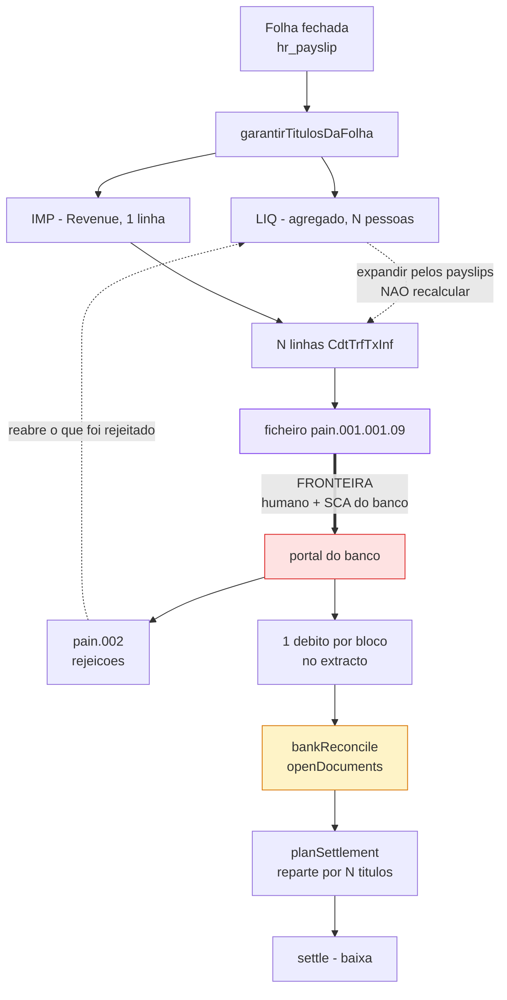

# Pagar pelo banco — o que dá para fazer, e o que exige licença

> Levantado em 2026-09-04. Pergunta do utilizador: *"não sei como faremos a
> conexão futura com o banco para fazer pagamentos (depende de certificação eu
> acho, já deixa algo pra isso)"*.
>
> O fluxo que ele descreve acaba em três passos: **gerar em lote um título de
> folha → conciliar no banco → realizar o pagamento**. Os dois primeiros já
> existem. Este documento é sobre o terceiro.
>
> Complementa [plano-conciliacao-ingestao.md](plano-conciliacao-ingestao.md),
> que tratou do lado da **leitura** (Open Banking / AISP). Aqui é o lado da
> **escrita**, que é regulado de outra maneira e muito mais cara.

---

## A resposta curta, antes das trinta páginas

**O ficheiro SEPA é o caminho. A ligação directa ao banco não compensa a esta
escala, e provavelmente nunca vai compensar.**

Três factos sustentam isso, e nenhum deles é opinião:

1. **Gerar um ficheiro de pagamentos não é actividade regulada.** O ACCENTRA
   escreve um XML, alguém com poderes na conta carrega-o no portal do banco e
   autoriza com a autenticação do próprio banco. O dinheiro sai da conta do
   cliente por mandato do cliente. O software nunca toca em dinheiro, nunca
   guarda credencial, e não é prestador de serviços de pagamento de ninguém.

2. **Iniciar pagamentos por API (PIS) exige autorização do Banco Central da
   Irlanda** — €50.000 de capital inicial, e o prazo real de autorização anda
   entre 9 e 18 meses. Para 35 clientes que pagam salários uma vez por semana
   ou por mês, isto é desproporcionado por uma ordem de grandeza.

3. **A alternativa de comprar a um intermediário (TrueLayer, Yapily, GoCardless)
   contradiz o motivo pelo qual este produto é self-host.** O escritório mudou
   para instalação local por exigência de compliance: o dado não sai. Um
   agregador vê as transacções. Não é um pormenor técnico — é a premissa
   fundadora do produto a ser invertida.

O que o ACCENTRA deve fazer é **preparar a ordem de pagamento até ao último
milímetro e parar na fronteira do banco**. É exactamente a mesma linha já
traçada para o ROS na v1.48 — *"não envia, e isso é deliberado: o ROS exige o
certificado digital do escritório, e uma credencial não entra num sistema sem
quem manda nela decidir como"*. A regra vale igual, e por motivo mais forte:
uma submissão errada ao ROS corrige-se; um pagamento errado sai da conta.

---

# 1. Como se paga a partir de um ERP, na Irlanda, em 2026

## 1.1 SEPA Credit Transfer por ficheiro — o caminho real

É assim que toda a gente paga salários e fornecedores em lote na Irlanda. O ERP
escreve um XML ISO 20022, e o portal de banca empresarial engole-o.

### A armadilha da versão, e ela é urgente

O pedido falava em `pain.001.001.03`. **Essa versão está a ser desligada.**

- As *Customer-to-PSP Implementation Guidelines* do European Payments Council
  passaram para **`pain.001.001.09`** com o rulebook que entrou em vigor a
  **19 de Novembro de 2023**.
- O **AIB avisou os submissores de ficheiros em lote que têm de fazer as
  alterações ISO 20022 antes de 12 de Novembro de 2026**, e que depois dessa
  data os ficheiros podem falhar.
- O **Bank of Ireland** já aceita `pain.001.001.09` **a par do** `.03`.

Hoje é 4 de Setembro de 2026. **Faltam dez semanas para a data do AIB.**

> **Consequência para o plano:** se algum dia se escrever este gerador, nasce
> em `pain.001.001.09` e não no `.03`. Escrever o `.03` agora seria construir
> algo com prazo de validade de dois meses.

Há um efeito lateral do `.09` que vale conhecer antes de decidir o desenho: a
partir de Novembro de 2026, quem enviar **morada** do beneficiário tem de a
enviar em formato **estruturado ou híbrido** — não mais linhas de texto livre.
O `clients.address` do ACCENTRA é um campo de texto único, sem país, sem linhas
separadas, sem Eircode. **A saída é simples: não enviar morada nenhuma.** A
morada é opcional no SCT, o AIB substitui o país do devedor pelo país da conta,
e o pagamento não precisa dela. Não enviar é mais correcto do que enviar mal.

### O que cada banco pede

| Banco | Como se chama | Formato | O que exige para activar |
|---|---|---|---|
| **AIB** | Bulk Payment Upload, dentro do *iBB* (Internet Business Banking); há também *SEPA Instant Bulk Payments* | `pain.001.001.09` (o `.03` morre a 12/11/2026) | **OIN** — Originator Identification Number, acordado com o banco, no formato `IE##SCT######`. Sem ele o ficheiro é recusado no header |
| **Bank of Ireland** | SEPA file upload, Business On Line | `.03` e `.09`, os dois | Registo de submissor de ficheiros |
| **PTSB** | Bulk Uploads no *Business24* — **operado pelo parceiro Sentenial** | Ficheiro de lote | **Formulário de registo em balcão** (*Electronic Bulk Transfer Registration Form*) |
| **Revolut Business** | Bulk payments | **CSV ou XML**, até 1.000 linhas | Nada de especial. Só na app web, não na móvel |
| **Wise Business** | Batch payments | **CSV ou XLSX**, até 1.000 transferências | Nada de especial |

Dois pormenores do PTSB que interessam à secção de segurança mais abaixo: o
ficheiro pode ser carregado **directamente no Sentenial**, sem passar pelo
Business24 — a documentação diz explicitamente que é para o caso de *não se
querer dar acesso à conta da empresa ao pessoal de RH/administrativo*. É
segregação de funções desenhada pelo próprio banco, e é um bom argumento para
o desenho que se propõe aqui.

### O que o AIB valida, e que ninguém adivinha à primeira

Estas regras vêm da especificação publicada do AIB, e cada uma delas é um
ficheiro recusado se for ignorada:

- **Conjunto de caracteres restrito.** Só `a-z`, `A-Z`, `0-9`, espaço e
  `/ - ? : ( ) . , ' +`. **`ß`, `Å` e `&` são inválidos**, e caracteres
  inválidos podem ser substituídos por espaço *ou o ficheiro pode não ser
  processado*. Acentos não passam.

  > **Isto atinge este produto em cheio.** Os funcionários das empresas do
  > escritório têm nomes portugueses, brasileiros e irlandeses — *Conceição*,
  > *Ó Súilleabháin*, *João*. O nome do beneficiário tem de ser transliterado
  > antes de entrar no XML. E o AIB avisa, no mesmo documento, que *"o pagamento
  > corre o risco de ser parado pela instituição receptora se o nome não for
  > exacto"*. Transliterar mal é um salário que não chega.

- **Máximo 25 blocos de pagamento por ficheiro.** Um bloco = uma conta a debitar
  + uma data de execução. Folha semanal de várias empresas no mesmo ficheiro
  bate neste tecto depressa.
- **`ChrgBr` tem de ser `SLEV`.** O AIB substitui qualquer outro valor.
- **IBAN do beneficiário é obrigatório.** BIC é opcional (regra *IBAN only*).
- **`DbtrAgt/FinInstnId/Othr/Id` tem de conter literalmente `NOTPROVIDED`.**
- **Data de execução:** até 30 dias no futuro, nunca no passado, e o **primeiro**
  bloco tem de ter a data mais antiga do ficheiro.
- **Detecção de duplicados do lado do banco:** o AIB marca ficheiros como
  potencialmente duplicados quando coincidem **OIN + soma de controlo do header
  + data de execução**.

  > **Este é o mais perigoso de todos para uma folha**, e ao contrário dos
  > outros não dá erro no sítio certo. Duas semanas seguidas com exactamente o
  > mesmo total e a mesma data de execução — que numa folha de quadro fixo é o
  > caso *normal*, não a excepção — parecem ao banco o mesmo ficheiro enviado
  > duas vezes. O que faz falta não é código: é o `MsgId` e o `PmtInfId`
  > carregarem o período, e alguém saber de antemão que o banco vai perguntar.

- **`EndToEndId`**: 35 caracteres, viaja com o pagamento e os bancos irlandeses
  podem mostrá-lo no extracto do beneficiário. É aqui que vai a referência que
  faz o funcionário reconhecer o que recebeu.
- Além do portal, o AIB aceita o mesmo ficheiro por **SFTP ou Connect:Direct**.
  Isto é relevante para a Fase 3 mais abaixo.

### Verification of Payee — a novidade de 2025 que muda o cadastro

Desde **9 de Outubro de 2025**, o Regulamento dos Pagamentos Instantâneos
(UE 2024/886) obriga **todos** os prestadores de serviços de pagamento da UE a
oferecer *Verification of Payee*: antes de executar a transferência, verifica-se
se o **nome** do beneficiário bate com o **IBAN**. O resultado é um semáforo —
*match*, *close match*, *no match*.

Duas coisas a reter, e a segunda contraria o que se assume:

1. **Para ficheiros em lote, a VoP não se aplica por omissão** — a empresa pode
   optar por activá-la. Ou seja, o lote de salários não fica bloqueado por
   causa disto.
2. **Mas isso torna o cadastro mais crítico, não menos.** Sem VoP a validar, um
   IBAN certo com nome errado passa sem aviso nenhum. O `hr_employees.iban`
   entrou na migração 062 *deliberadamente sem validação de formato*, e o
   comentário explica bem porquê (um IBAN estrangeiro válido não passa numa
   regra escrita para o irlandês). Essa decisão continua certa. O que ela
   implica é que a **conferência tem de estar noutro sítio** — na pré-visualização
   do ficheiro, antes de sair, e com olhos humanos.

## 1.2 SEPA Direct Debit — não serve para salários, e é importante perceber porquê

O pedido pergunta se o SDD, ou "SEPA batch com originator ID", se aplica ao
pagamento de salários. **Não se aplica, e a confusão é comum.**

- O **Direct Debit puxa** dinheiro da conta de outra pessoa. O **Credit Transfer
  empurra** dinheiro da nossa conta para a de outra pessoa. Um salário é sempre
  um *empurrar*: a empresa manda, não vai buscar.
- Para puxar é preciso um **mandato assinado pelo devedor**. Nenhum funcionário
  assina um mandato a autorizar o empregador a mexer na conta dele — seria
  absurdo, e o esquema SDD nem sequer o contempla para esta finalidade.
- O **Creditor Identifier** (o "originator ID" do mundo do SDD) é uma coisa do
  SDD. Não é o que faz falta aqui.

**O que confunde é que o AIB usa um identificador de originador no SCT também.**
É o tal **OIN** (`IE##SCT######`), no `InitgPty` do cabeçalho — e o `SCT` no meio
do código diz precisamente que é o do Credit Transfer, não o do Direct Debit. São
dois identificadores diferentes, com nomes parecidos, para esquemas opostos.

> Onde o SDD **serve** neste produto: do lado do **recebimento**. Um cliente do
> escritório que cobre mensalidades poderia cobrar por débito directo. Isso sim
> exigiria Creditor Identifier, gestão de mandatos e as regras de devolução —
> e é um módulo inteiro, não uma variação deste. Fica registado como coisa
> distinta, para não se voltar a misturar.

## 1.3 PSD2 / Open Banking com iniciação de pagamento (PIS) — o que custa mesmo

Aqui está a resposta à intuição do utilizador sobre "certificação". Ele estava
certo a suspeitar; estava apenas a subestimar.

**O que é regulatório e incontornável:**

| Requisito | Detalhe |
|---|---|
| **Autorização do Banco Central da Irlanda** | Iniciação de pagamentos é um serviço de pagamento sob a PSD2. Exige autorização como Payment Institution |
| **Capital inicial** | **€50.000** para PIS. O montante final é notificado caso a caso, pela natureza e escala do negócio |
| **Prazo** | O relógio estatutário são 3 meses **a contar de um processo completo**. O prazo real anda entre **9 e 18 meses**, e a Irlanda é dos reguladores mais exigentes |
| **Taxa de candidatura** | Não há, na Irlanda. É o único item barato da lista |
| **Sustentação** | Plano de negócio, governação, controlo interno, continuidade, e **projecções que demonstrem cumprir os requisitos de capital nos primeiros três anos** |
| **Certificados eIDAS** | **QWAC** (identifica o TPP no TLS) e **QSEALC** (sela os dados). O artigo 34 das RTS exige que **cada chamada** entre banco e TPP seja autenticada com certificado qualificado. Compram-se a um QTSP, e renovam-se |

O custo real não é o capital nem os certificados — é o **pessoal de compliance
permanente** que uma entidade regulada tem de ter. Não é um projecto; é uma
mudança do que a empresa é.

**O que se compra a um intermediário:** TrueLayer, Yapily, GoCardless e Plaid
vendem exactamente isto, e a via é o **modelo de agente** — sob a PSD2 um
prestador autorizado pode servir clientes através de agentes, que **não são
regulados por si**, e o prestador responde por tudo o que o agente faz. É real e
funciona.

**Mas há duas objecções a esta via, e a segunda é fatal para este produto:**

1. O intermediário cobra por transacção ou por ligação, para sempre. Para 35
   clientes a pagar salários, o custo por pagamento contra o custo de alguém
   carregar um ficheiro num portal não se justifica.
2. **O agregador vê as transacções.** O escritório mudou para self-host por
   exigência de compliance irlandesa — *dado nenhum sai*. Encaminhar ordens de
   pagamento por um terceiro em nuvem inverte precisamente a decisão que
   justificou a instalação local. Isto já tinha sido registado no
   [plano de conciliação](plano-conciliacao-ingestao.md) para o lado da leitura
   (AISP); vale igual, e mais, para o lado da escrita.

> Nota sobre a Xero, que serve de referência de escala: a Xero **não tem**
> licença irlandesa própria. Está registada como AISP pela autoridade
> dinamarquesa e usa a Tink como intermediária técnica na Irlanda. Se uma
> empresa cotada em bolsa acha que não vale a pena obter licença própria em
> Irlanda, é um sinal razoavelmente forte.

## 1.4 EBICS e conectividade corporativa — geografia errada

**O EBICS não é um caminho na Irlanda.** É um standard regional, usado sobretudo
na **Alemanha, Áustria, Suíça e França**. Os bancos irlandeses não o oferecem.

O equivalente irlandês de "conectividade corporativa" é o **host-to-host**: uma
ligação bilateral em que o banco define o formato e a empresa entrega ficheiros.
No AIB isso tem nome concreto e está na própria especificação — **SFTP ou
Connect:Direct**, entregando o mesmo `pain.001` que se carregaria no portal.

Ou seja: **a conectividade corporativa no AIB não é um formato diferente, é uma
porta diferente para o mesmo ficheiro.** Isso é uma boa notícia para o desenho —
se um dia se automatizar o envio, o gerador não muda; muda só quem carrega.

O SWIFT (host-to-host global) é para multinacionais e tem custo de adesão
incompatível com esta escala.

## 1.5 O que um escritório pequeno pode mesmo fazer

**Pode, sem se tornar entidade regulada:**

- Gerar ficheiros `pain.001` para os clientes.
- Carregar esses ficheiros no portal do banco **do cliente**, se tiver mandato
  na conta do cliente.
- Automatizar a entrega por SFTP, com acordo do banco.
- Ler extractos e conciliar (é o que já faz).

**Não pode, sem autorização:**

- Iniciar pagamentos por API PSD2 em nome dos clientes.
- Fazer o dinheiro passar por uma conta do escritório antes de chegar ao
  destino. **Isto é a fronteira, e é a que se atravessa por acidente.**

A distinção que manda vem da própria doutrina do sector sobre processadores de
folha: quem apenas **calcula os montantes e prepara os pagamentos a partir da
conta do cliente, sem deter os fundos**, não presta serviço de pagamento. A
partir do momento em que os fundos **passam** pela conta do escritório, é
remessa de dinheiro, e isso é actividade regulada.

> **Regra de bolso, e devia estar escrita na parede:** o dinheiro sai da conta
> do cliente e chega ao funcionário. Se em algum momento estiver numa conta do
> escritório, alguém tem de falar com um advogado antes de continuar. Nada
> neste documento é aconselhamento jurídico.

---

# 2. Como isto encaixa no ACCENTRA

## 2.1 O que já existe, e é mais do que parece

Lido o código, o produto está **mais perto do que se esperaria** — a folha já
nasce como dívida, e a dívida já sabe quase tudo o que um pagamento precisa.

| Peça | Onde | Estado |
|---|---|---|
| Folha fechada vira dois títulos a pagar (líquido e imposto) | `lib/financial/payrollTitles.ts` → `garantirTitulosDaFolha` | Funciona, com idempotência por chave determinística |
| Referência de pagamento no título | `ledger_items.payment_reference` (migração 062) | Já preenchida com o `document_ref` |
| IBAN do beneficiário no título | `ledger_items.payee_iban` (migração 062) | Coluna existe, **vazia** |
| IBAN do funcionário | `hr_employees.iban` (migração 062) | Coluna existe |
| Beneficiário, valor, vencimento | `counterparty`, `original_amount`, `due_date` | Já lá estavam |
| Baixa do título contra movimento do banco | `lib/accounting/service.ts` → `baixarPeloBanco`, `settle` | Funciona, com desfazer do movimento se o razão falhar |
| Divisão de uma linha de extracto por vários documentos | `lib/bankSplit.ts` → `planSettlement` | Função pura, genérica sobre `key` — **serve para títulos sem alteração** |
| Leitura de extracto CSV/Excel/PDF | `lib/bankStatement.ts`, `lib/pdfStatement.ts` | Provado contra extractos AIB reais |

A migração 062 já diz, em comentário, exactamente onde pára: *"Isto NÃO constrói
o envio ao banco. Deixa o título pronto para o dia em que ele existir; o ficheiro
SEPA, a autorização e o envio são trabalho próprio."* Este documento é esse dia,
no papel.

## 2.2 O que falta — e o buraco não é onde parece

O pedido pergunta que **campos** faltam no título. A resposta honesta é que
faltam poucos campos e **falta uma estrutura**. A estrutura é o problema maior.

### O buraco estrutural: o título do líquido é um agregado

O título `FOLHA 2026-S35 LIQ` é **um** registo, com **um** valor, e beneficiário
`Employees (net pay)`. Mas o pagamento correspondente são **N transferências**,
uma por funcionário, cada uma para um IBAN diferente.

A migração 062 já tinha visto isto e documentou-o no próprio comentário da
coluna — *"Nulo no título do líquido da folha: ali o dinheiro vai para N contas,
uma por funcionário"*. Está certo. Mas a consequência é que:

> **O título do líquido nunca vira uma linha de pagamento. Vira um bloco de
> linhas.** O gerador do ficheiro tem de o *expandir* a partir dos payslips
> fechados do período, e o líquido de cada pessoa tem de vir do `hr_payslip`
> gravado — **nunca de um recálculo**. Recalcular no momento de pagar é a mesma
> armadilha já identificada em `garantirTitulosDaFolha`: o título diria um valor
> e o recibo diria outro.

O título do **imposto** é o caso fácil: um beneficiário (a Revenue), um IBAN, uma
linha. É por aí que se começa, se um dia se começar.

### Os campos que faltam mesmo

| Campo do `pain.001` | De onde viria | Estado |
|---|---|---|
| `InitgPty/Id/OrgId/Othr/Id` — **o OIN** | Não existe em lado nenhum | **Falta.** É por cliente e por banco, acordado com o banco. Não é derivável |
| `DbtrAcct/Id/IBAN` — IBAN da conta a debitar | `bank_accounts.account_ref` | **Não fiável.** O comentário do esquema diz *"IBAN ou últimos dígitos"*. É texto livre. Um campo `iban` a sério faz falta |
| `Cdtr/Nm` do fornecedor | `invoices.supplier_name` | Existe, mas **sem transliteração** |
| `CdtrAcct/Id/IBAN` do fornecedor | Nenhures | **Falta.** O `ledger_items.payee_iban` existe mas está vazio, e o sítio certo do IBAN de um fornecedor é o **cadastro do fornecedor**, não a nota — senão pede-se a cada factura |
| Identidade do **lote** | Não existe | **Falta.** Sem ela não há como dizer "este ficheiro já foi enviado" |
| Leitura do `pain.002` (rejeições) | Não existe | **Falta.** Ver abaixo |

### O `pain.002` — o campo que ninguém se lembra e que estraga tudo

O AIB devolve um ficheiro **`pain.002`** com as rejeições. Uma transferência pode
ser **aceite no ficheiro e rejeitada depois**: IBAN fechado, conta inexistente,
nome que o banco receptor recusa.

> Se o sistema marcar o título como pago no momento em que gera o ficheiro,
> **uma rejeição deixa o razão a dizer que o salário foi pago quando não foi** —
> e a pessoa que não recebeu descobre primeiro que o sistema. Este é o defeito
> que custa mais caro de todos os que estão nesta lista, e é o mais fácil de não
> ver, porque só aparece na semana em que alguma coisa corre mal.
>
> **A regra que decorre daqui: gerar o ficheiro NÃO baixa o título.** O título
> baixa quando o **extracto** mostra o dinheiro a sair. É o mesmo princípio que
> já manda em `baixarPeloBanco` — *"o movimento no banco vem primeiro de
> propósito: é o facto do mundo real"*.

## 2.3 A volta: como o pagamento casa outra vez com o título

Aqui há um problema real e já observado. O agente `folha-e2e` verificou em
produção, no DEMO-COR: fechou a folha da semana 35, nasceram os títulos, eles
aparecem correctos em Accounts Payable — e **no ecrã de conciliação a linha de
extracto de €234,00 diz "Nenhum documento em aberto parecido com esta linha"**.

A causa está em `lib/bankReconcile.ts`: `openDocuments()` monta candidatos a
partir de `invoices` e `sales`, e **`ledger_items` não entra**. Nenhum título de
folha, de imposto ou manual é oferecido como candidato. O `settle()` já aceita
`ledgerItemId`; falta o lado dos candidatos e o `MatchCandidate.kind`, que hoje
só conhece `"invoice" | "sale"`.

**Isto é pré-requisito de tudo o resto neste documento.** Não vale a pena gerar
ficheiro de pagamento enquanto o pagamento não souber voltar.

### Porque não é "acrescentar um terceiro tipo de candidato"

Medido o âmbito (por `folha-e2e`, e conferido aqui), há uma **assimetria no
modo de liquidar** que não se vê de fora e que é o verdadeiro trabalho:

| | Nota de compra / venda | Título (`ledger_items`) |
|---|---|---|
| Como fica liquidado | **Implícito**: uma coluna `invoice_id` / `sale_id` na própria `bank_transactions` | **Explícito**: uma linha em `ledger_settlements` **mais** a partida no razão, escritas por `settle()` |
| Quem escreve | `reconcileLine`, com um `insert` directo | `settle()` em `lib/accounting/service.ts` |

`reconcileLine` só conhece o modo implícito. Conciliar um título não é preencher
mais uma coluna — é **chamar um segundo mecanismo de liquidação** dentro da
mesma função. É aí que está o esforço, e não nos candidatos.

O que **é** pequeno, e vale registar para quem lá for:

- A view `ledger_items_open` (migração 026) já devolve `outstanding_amount` e
  `status` calculados. O terceiro bloco de `openDocuments()` são poucas linhas.
- Em `suggestMatches`, `expected` deduz-se hoje do **sinal** da linha
  (`amount < 0 → "invoice"`). Um título tem `kind` próprio: `payable` casa com
  saída, `receivable` com entrada. É uma condição, não uma reescrita.

### E a trava que impede fazer metade

> **Um candidato que se pode escolher mas cuja baixa não é escrita é pior do
> que não haver candidato nenhum.** A linha ficaria marcada como conciliada, o
> movimento no banco criado, e o título a dever na mesma — o mesmo dinheiro
> contado duas vezes, com o ecrã a dizer que está tudo certo. A situação de
> hoje ("nenhum documento em aberto parecido com esta linha") é feia, mas é
> **visível**, e por isso corrigível.

Sobre voltar atrás, há uma boa notícia que corrige uma suposição minha: **o
caminho de reversão já existe e já está decidido.** O `undoLine` já sabe de
`ledger_settlements` — quando o movimento deu baixa num título, **recusa**, e
manda desfazer no painel do título. O comentário no código explica porquê, e a
razão é boa: *"a baixa é uma decisão contábil, e desfazê-la a partir do ecrã do
banco escondia dela quem a tomou"*. O `unlinkLine` desfaz só o vínculo e deixa
o dinheiro lançado, que é o estado verdadeiro.

Ou seja, quem construir isto **não tem de inventar a reversão** — herda uma
recusa deliberada. O que tem de aceitar é a consequência: desfazer a
conciliação de uma folha manda o utilizador para outro ecrã, ao contrário do
que acontece com uma nota. Assimetria real, e defensável.

E há um segundo problema, que só aparece quando o ficheiro existir:

> **O AIB posta UM débito por bloco de pagamento**, não um por transferência. A
> especificação é explícita: *"um único débito será postado na conta para todos
> os pagamentos dentro do mesmo bloco, independentemente de quantos pagamentos
> individuais sejam feitos"*.
>
> Ou seja, o extracto traz **uma linha de €4.812,37** e do outro lado estão
> **onze funcionários**. Não é um casamento um-para-um.

A boa notícia é que a peça para isto **já existe e já está certa**:
`planSettlement` em `lib/bankSplit.ts` é uma função pura, genérica sobre `key`,
que reparte o valor de uma linha por vários documentos, obriga a soma das partes
a fechar com o valor da linha, e manda a diferença de cêntimos para conta de
arredondamento em vez de a esconder. É exactamente o que faz falta. Só precisa
que os candidatos incluam títulos.

> **E precisa de funcionar no painel de dividir, não só no casamento
> um-para-um.** Com pagamento por ficheiro, o débito único por bloco é o caso
> **normal** da folha, não a excepção: uma linha de extracto contra N
> funcionários, ou contra LIQ e IMP quando os dois vão no mesmo bloco. Um
> `kind: "ledger"` que só funcione no casamento simples resolve o caso raro e
> falha o comum.



A caixa amarela é a que hoje está partida. A caixa vermelha é a fronteira que
**não se deve** automatizar sem as travas da secção 3.

## 2.4 Onde o ficheiro seria gerado

Uma rota de servidor, e nunca no browser — o ficheiro tem IBANs de toda a gente.
O sítio natural, seguindo a organização actual:

- `lib/payments/sepaCreditTransfer.ts` — **função pura**: recebe a lista de
  linhas já resolvidas e devolve a string XML. Sem base de dados, testável
  contra ficheiros de referência. É o mesmo padrão de `titulosDaFolhaPuro.ts` e
  de `bankSplit.ts`, e é o que permite escrever os testes chatos que importam
  (transliteração, blocos, somas de controlo).
- `lib/payments/lote.ts` — o lado com base de dados: junta títulos, expande a
  folha pelos payslips, resolve IBANs, e grava o lote.
- `app/api/clients/[id]/payments/batch/route.ts` — a rota, com as autorizações.

**Uma tabela nova faz falta**, e é pequena:

```
payment_batches      -- o lote: cliente, conta a debitar, data de execucao,
                     -- estado, quem gerou, quem aprovou, hash do ficheiro
payment_batch_lines  -- a linha: titulo de origem (ou funcionario),
                     -- beneficiario, IBAN, valor, EndToEndId
```

O `EndToEndId` gravado na linha é o que fecha o círculo: é o que viaja com o
pagamento, é o que pode aparecer no extracto do beneficiário, e é por ele que se
identifica uma rejeição no `pain.002`.

## 2.5 Nuvem contra self-host

| | Nuvem (Vercel/Supabase) | Self-host local |
|---|---|---|
| **Gerar o ficheiro** | Funciona igual | Funciona igual |
| **Onde o ficheiro repousa** | **Em lado nenhum.** Gerar e transmitir na resposta, sem gravar. Guardar um ficheiro com os IBANs de toda a gente num bucket em nuvem é passivo sem contrapartida | Pode ficar em disco, na máquina do escritório, com as permissões do sistema de ficheiros |
| **Envio automático por SFTP** | **Não.** Exigiria a chave privada do banco em variável de ambiente numa plataforma de terceiro | Possível — a chave vive na máquina, como qualquer outra credencial operacional |
| **Aprovação de duas pessoas** | Igual — é regra de base de dados, não de alojamento | Igual |

**A conclusão prática é boa para o produto:** a versão self-host é a única em que
faz sentido, um dia, automatizar o envio. Isso reforça o argumento comercial que
já estava registado no plano de conciliação — *"se o produto for distribuído, o
self-host vira vantagem comercial"*. Aqui deixa de ser argumento de marketing e
passa a ser consequência técnica.

Na nuvem, a fronteira fica no download. E fica bem.

---

# 3. Um esboço concreto do `pain.001`

Feito a partir dos dados que **este** sistema já tem. Os valores são os do
DEMO-COR da semana 35 (€234,00 líquido, €21,06 imposto) — dados de teste, nunca
reais. Os IBANs e o OIN são inventados.

Cada campo está marcado: **`[OK]`** existe, **`[GERA]`** calcula-se na hora,
**`[FALTA]`** não existe no sistema.

```xml
<?xml version="1.0" encoding="UTF-8"?>
<Document xmlns="urn:iso:std:iso:20022:tech:xsd:pain.001.001.09">
 <CstmrCdtTrfInitn>

  <GrpHdr>
   <MsgId>ACC-DEMOCOR-2026S35-01</MsgId>          <!-- [GERA] tem de variar por
                                                        periodo: o AIB acha
                                                        duplicado por OIN +
                                                        CtrlSum + data          -->
   <CreDtTm>2026-09-04T09:12:00</CreDtTm>          <!-- [GERA]                   -->
   <NbOfTxs>4</NbOfTxs>                            <!-- [GERA] 3 pessoas + Revenue -->
   <CtrlSum>255.06</CtrlSum>                       <!-- [GERA] 234,00 + 21,06     -->
   <InitgPty>
    <Nm>DEMO-COR Ltd</Nm>                          <!-- [OK] clients.name         -->
    <Id><OrgId><Othr>
     <Id>IE42SCT123456</Id>                        <!-- [FALTA] o OIN. Acordado
                                                        com o AIB, por cliente.
                                                        Nao existe no esquema     -->
    </Othr></OrgId></Id>
   </InitgPty>
  </GrpHdr>

  <!-- ============ BLOCO 1: o liquido, na data de pagamento ============ -->
  <PmtInf>
   <PmtInfId>DEMOCOR-2026S35-LIQ</PmtInfId>        <!-- [OK] document_ref         -->
   <PmtMtd>TRF</PmtMtd>
   <BtchBookg>true</BtchBookg>                     <!-- um debito so no extrato   -->
   <NbOfTxs>3</NbOfTxs>
   <CtrlSum>234.00</CtrlSum>
   <PmtTpInf><SvcLvl><Cd>SEPA</Cd></SvcLvl></PmtTpInf>
   <ReqdExctnDt><Dt>2026-09-04</Dt></ReqdExctnDt>  <!-- [OK] ledger_items.due_date
                                                        (= payDate no liquido)    -->
   <Dbtr><Nm>DEMO-COR Ltd</Nm></Dbtr>              <!-- [OK] clients.name.
                                                        SEM <PstlAdr>: ver 1.1    -->
   <DbtrAcct><Id>
    <IBAN>IE29AIBK93115212345678</IBAN>            <!-- [FALTA] bank_accounts
                                                        .account_ref e texto
                                                        livre: "IBAN ou ultimos
                                                        digitos"                  -->
   </Id></DbtrAcct>
   <DbtrAgt><FinInstnId><Othr>
    <Id>NOTPROVIDED</Id>                           <!-- exigencia do AIB          -->
   </Othr></FinInstnId></DbtrAgt>
   <ChrgBr>SLEV</ChrgBr>                           <!-- imposto pela lei          -->

   <!-- O titulo LIQ e UM registo de 234,00 e vira TRES linhas.
        O liquido de cada pessoa vem de hr_payslip, nunca recalculado. -->
   <CdtTrfTxInf>
    <PmtId>
     <EndToEndId>FOLHA 2026-S35 LIQ 001</EndToEndId>  <!-- [GERA] a partir de
                                                          payment_reference       -->
    </PmtId>
    <Amt><InstdAmt Ccy="EUR">78.00</InstdAmt></Amt>   <!-- [OK] hr_payslip        -->
    <Cdtr>
     <Nm>MARIA DA CONCEICAO SILVA</Nm>                <!-- [OK] hr_employees.name
                                                          MAS transliterado:
                                                          "Conceicao" sem cedilha,
                                                          senao o AIB recusa      -->
    </Cdtr>
    <CdtrAcct><Id>
     <IBAN>IE64IRCE92050112345678</IBAN>              <!-- [OK] hr_employees.iban
                                                          (migracao 062)          -->
    </Id></CdtrAcct>
    <RmtInf><Ustrd>DEMO-COR SALARIO SEMANA 35</Ustrd></RmtInf>
   </CdtTrfTxInf>

   <!-- ... mais duas linhas, uma por funcionario ... -->
  </PmtInf>

  <!-- ====== BLOCO 2: o imposto. Bloco proprio: outra data de execucao ====== -->
  <PmtInf>
   <PmtInfId>DEMOCOR-2026S35-IMP</PmtInfId>
   <PmtMtd>TRF</PmtMtd>
   <NbOfTxs>1</NbOfTxs>
   <CtrlSum>21.06</CtrlSum>
   <ReqdExctnDt><Dt>2026-10-14</Dt></ReqdExctnDt>  <!-- [OK] vencimentoDoImposto
                                                        DaFolha: dia 14           -->
   <Dbtr><Nm>DEMO-COR Ltd</Nm></Dbtr>
   <DbtrAcct><Id><IBAN>IE29AIBK93115212345678</IBAN></Id></DbtrAcct>
   <DbtrAgt><FinInstnId><Othr><Id>NOTPROVIDED</Id></Othr></FinInstnId></DbtrAgt>
   <ChrgBr>SLEV</ChrgBr>
   <CdtTrfTxInf>
    <PmtId><EndToEndId>FOLHA 2026-S35 IMP</EndToEndId></PmtId>
    <Amt><InstdAmt Ccy="EUR">21.06</InstdAmt></Amt>
    <Cdtr><Nm>REVENUE COMMISSIONERS</Nm></Cdtr>    <!-- [OK] counterparty, mas
                                                        "Revenue (PAYE/USC/PRSI)"
                                                        nao e o nome da conta      -->
    <CdtrAcct><Id>
     <IBAN>IE00XXXX00000000000000</IBAN>           <!-- [FALTA] payee_iban vazio.
                                                        E o IBAN da Revenue nao e
                                                        adivinhavel: depende do
                                                        imposto e do registo       -->
    </Id></CdtrAcct>
    <RmtInf><Ustrd>PAYE 8123456A 2026-09</Ustrd></RmtInf>  <!-- [FALTA] a Revenue
                                                        casa pela referencia. Sem
                                                        o registo certo o dinheiro
                                                        chega e nao se sabe a que
                                                        se refere                  -->
   </CdtTrfTxInf>
  </PmtInf>

 </CstmrCdtTrfInitn>
</Document>
```

**O que este esboço torna visível, e que uma lista de campos não tornava:**

1. **Faltam quatro coisas, não catorze.** OIN, IBAN da conta a debitar, IBAN do
   beneficiário quando não é funcionário, e a referência fiscal da Revenue. O
   resto o sistema já sabe.
2. **Duas delas não são código — são cadastro.** O OIN vem do banco. O IBAN da
   Revenue vem do registo fiscal do cliente. Nenhum se resolve a programar.
3. **A transliteração é obrigatória e ninguém se lembra dela.** `Conceição` →
   `CONCEICAO`. Se não se fizer, ou o AIB substitui por espaço, ou o ficheiro
   não é processado — e nas duas hipóteses alguém não recebe.
4. **O bloco é a unidade, não o ficheiro.** Líquido e imposto têm datas de
   execução diferentes, logo são blocos separados, logo são **dois débitos
   separados** no extracto. Isso é bom: casa melhor com os dois títulos.

---

# 4. Segurança — e aqui não há espaço para simpatia

Um ERP que gera ordens de pagamento é um alvo. Não pela sofisticação do
atacante: pelo valor por linha alterada. Mudar um IBAN numa tabela é a fraude
mais barata que existe, e é praticamente invisível se ninguém a procurar.

## 4.1 O que tem de existir ANTES da primeira linha gerada

### Um perfil que possa aprovar — e hoje não existe

O modelo actual tem `role` em `app_users` com dois valores na prática (`master`,
`user`), e a árvore de permissões em `lib/permissions.ts` é **por ecrã, não por
acção**. O comentário no topo do ficheiro diz isso explicitamente, e explica bem
o porquê: *"Acção (criar/editar/apagar). Grão de acção multiplica a árvore por
quatro e ninguém preenche. Se um dia precisar, entra como terceiro nível."*

> **Este é esse dia.** "Ver os pagamentos" e "autorizar os pagamentos" não podem
> ser a mesma permissão. Não é grão a mais: é a diferença entre um ecrã e uma
> ordem irrevogável.

### Aprovação por duas pessoas, na base de dados

Maker-checker, e com três regras que não são negociáveis:

- **Quem gera não aprova.** `created_by <> approved_by`, e isto é uma
  **constraint na tabela**, não uma verificação no ecrã. Verificação de ecrã
  contorna-se com um `curl`.
- **Aprovar congela o conteúdo.** Grava-se o **hash do ficheiro** aprovado. Se
  o ficheiro descarregado não bater com o hash aprovado, não é o ficheiro que
  foi aprovado. Sem isto, a aprovação recai sobre um lote que ainda pode mudar,
  e a assinatura não vale nada.
- **Alterar uma linha depois de aprovada invalida a aprovação.** Volta a
  pendente. Sem excepções, sem "só mudei a referência".

### Limites por valor

Um tecto por lote e um tecto por linha, por cliente. O tecto não impede — obriga
a uma segunda aprovação. O valor certo sai do histórico de cada cliente: uma
folha semanal de €4.800 num cliente que nunca passou de €5.200 é normal; num
cliente cuja folha é €900 é um alarme.

**O tecto que mais serve é o que ninguém pensa:** comparar com a **folha do
período anterior**. Um lote 40% acima da última folha, sem funcionário novo no
cadastro, é a assinatura de uma linha adulterada.

### Registo de auditoria imutável

Não é uma tabela com um `updated_at`. É append-only, com a escrita garantida
pela base de dados:

- `revoke update, delete` na tabela de auditoria para o utilizador da aplicação.
- Cada alteração de **IBAN** — de funcionário ou de fornecedor — é um evento
  auditado por si, com valor antigo e novo, autor e momento. **O IBAN é o campo
  que a fraude ataca**, e é o único que merece registo próprio.
- O lote guarda o hash do ficheiro e quem o descarregou.

Já há precedente no produto para isto (`009_review_audit.sql`, e a trilha de
auditoria da camada B3). Não é território novo — é aplicar o que já se faz.

### E uma trava que é quase grátis

**Um IBAN alterado há menos de 24 horas não entra num lote sem confirmação
explícita.** Custa uma cláusula na consulta e apanha o ataque mais comum:
mudar o IBAN pouco antes de a folha correr, receber, e repor.

## 4.2 O que NUNCA deve viver no sistema

Segue a linha já traçada para o ROS na v1.48, e pelo mesmo raciocínio:

| Nunca | Porquê |
|---|---|
| **Credenciais de banca online do cliente** | Já é regra do produto — o [plano de conciliação](plano-conciliacao-ingestao.md) recusou guardar credencial de portal de fornecedor pelo mesmo motivo. Credencial de banco é pior |
| **Certificados eIDAS (QWAC/QSEALC), ou qualquer chave de assinatura de pagamento** | Uma chave que assina ordens de pagamento, guardada num sistema que também as gera, elimina a única separação que interessa |
| **Chaves SFTP do banco em variável de ambiente** | Variáveis de ambiente vão parar a ficheiros `.env`, e ficheiros `.env` vão parar a backups, a cópias de trabalho e — o repositório é público — a acidentes. Se um dia houver envio automático, a chave entra **por ecrã**, cifrada com uma chave que não vive no mesmo sítio, e **só na versão self-host** |
| **Tokens OAuth de Open Banking com âmbito de pagamento** | Se um dia se for por aí, o consentimento é do cliente, no banco do cliente, e revogável por ele |

## 4.3 O que este produto NÃO deve fazer — opinião, e com razões

**1. Não deve enviar pagamentos sozinho, mesmo quando for tecnicamente capaz.**

A autenticação forte do portal do banco é a **única barreira que não está sob
controlo do ACCENTRA**. Enquanto o ficheiro precisar de um humano com um
segundo factor, comprometer o ACCENTRA por inteiro ainda não move dinheiro. No
dia em que o envio for automático, o ACCENTRA passa a ser um sistema cujo
comprometimento total é equivalente a acesso à conta bancária de 35 empresas.

Isto não é aversão a risco: é reconhecer que o ganho — poupar um carregamento de
ficheiro por semana — não paga aquilo que se perde.

**2. Não deve tornar-se PISP.** Ver a secção 1.3. Muda o que a empresa é.

**3. Não deve deixar o dinheiro passar por uma conta do escritório.** Atravessa a
fronteira regulatória, e atravessa-a por conveniência operacional, que é a pior
razão possível.

**4. Não deve marcar títulos como pagos ao gerar o ficheiro.** Ver 2.2. Um
`pain.002` de rejeição, ou um lote que ninguém carregou, deixa o razão a mentir.

**5. Não deve guardar o ficheiro gerado na nuvem.** Ver 2.5.

---

# 5. Um caminho por fases

Cada fase entrega algo sozinha — mesmo princípio do plano de conciliação. As
ordens de grandeza são de esforço, não promessas.

## Fase 0 — Fechar o buraco da conciliação `[PRE-REQUISITO]`

**Sem certificação nenhuma. Sem acordo com banco nenhum.**

`openDocuments()` passa a incluir `ledger_items` em aberto, `MatchCandidate.kind`
ganha `"ledger"`, e `reconcileLine` aprende a liquidar pelo caminho explícito
(`settle()`). É o que faz o título de folha aparecer na conciliação — hoje não
aparece, verificado em produção no DEMO-COR.

- **Ganha-se:** a folha deixa de ser um buraco no extracto. Sozinho já justifica.
- **Fora do software:** nada.
- **Esforço:** **semanas, não dias** — e a estimativa de "dias" que estava aqui
  antes estava errada. Os candidatos são pequenos; o que custa é o segundo
  mecanismo de liquidação dentro de `reconcileLine` (ver 2.3). Toca em
  `lib/bankMatch.ts`, `lib/bankReconcile.ts`, o POST de `lines/[lineId]`,
  `ReconcileRow.tsx` e `SplitSettlement.tsx`. Dois desses ficheiros estão sob
  teste, o que ajuda.
- **Não se pode entregar metade.** Ver a trava em 2.3: candidatos sem baixa
  contam o dinheiro duas vezes e o ecrã diz que está certo.
- **Está por decidir do utilizador.** O `folha-e2e` levantou-o, mediu-o, e não
  o construiu — o briefing dele excluía a ligação ao banco, e isto atravessa-a.
  Fica aqui como a primeira decisão a tomar, e não como trabalho em curso.

## Fase 1 — A lista de pagamentos a fazer

**Sem certificação. Sem banco.**

Um ecrã que junta os títulos vencidos e por vencer, com beneficiário, valor,
vencimento e referência, e exporta em PDF/Excel. Não gera XML nenhum.

- **Ganha-se:** quem paga deixa de compilar a lista à mão a partir de três
  ecrãs. É onde está a maior parte do tempo perdido hoje, e não custa quase nada.
- **Fora do software:** nada.
- **Esforço:** dias.

## Fase 2 — Cadastro: IBAN, OIN, e a Revenue

**Sem certificação. Precisa de recolha de dados.**

- `bank_accounts` ganha um campo `iban` a sério, separado do `account_ref` de
  texto livre.
- `clients` ganha o **OIN** por banco.
- IBAN no **cadastro do fornecedor**, não na nota.
- IBAN e referência da Revenue por cliente.
- Auditoria de alteração de IBAN, desde o primeiro dia — antes de haver
  pagamentos, não depois.

- **Ganha-se:** nada de visível. É a fase mais ingrata e a que decide se o resto
  funciona.
- **Fora do software:** **pedir o OIN ao banco de cada cliente** (AIB: pedido
  formal; PTSB: formulário em balcão), e recolher os IBANs dos funcionários com
  a autorização de cada um. É trabalho de escritório, e é o caminho crítico.
- **Esforço:** semanas, quase todas fora do software.

## Fase 3 — O ficheiro `pain.001.001.09`

**Sem certificação. Precisa de acordo com o banco (o OIN da Fase 2).**

O gerador puro, a expansão do título de folha pelos payslips, a transliteração,
os blocos, as somas de controlo, a tabela de lotes, a aprovação por duas pessoas
e os limites da secção 4. Descarrega-se; um humano carrega no portal.

- **Ganha-se:** o passo final do fluxo que o utilizador descreveu. Deixa de se
  digitar transferências uma a uma.
- **Fora do software:** o registo de submissor de ficheiros no banco, e um
  primeiro ficheiro de teste com o banco antes de o usar a sério. **Nunca estrear
  com a folha de um cliente real.**
- **Esforço:** semanas. A transliteração e os testes contra ficheiro de
  referência são metade do trabalho, e é a metade que evita o salário que não
  chega.

## Fase 4 — Ler o `pain.002` e conciliar o débito único

**Sem certificação.**

Importar o ficheiro de rejeições, reabrir o que foi rejeitado, e casar o débito
único do bloco com os N títulos via `planSettlement`.

- **Ganha-se:** o círculo fecha, e o razão deixa de poder mentir sobre uma
  rejeição.
- **Fora do software:** ir buscar o `pain.002` ao portal.
- **Esforço:** semanas.

## Fase 5 — Envio automático por SFTP `[SO SELF-HOST]`

**Sem regulação, mas com acordo formal do banco.**

O ACCENTRA entrega o ficheiro por SFTP/Connect:Direct em vez de o descarregar.

- **Ganha-se:** pouco. Poupa um carregamento manual.
- **Perde-se:** a barreira humana da secção 4.3. **A recomendação é não fazer**,
  ou fazer apenas com aprovação de duas pessoas já em produção e há meses.
- **Fora do software:** contrato de host-to-host com o banco, troca de chaves.
- **Esforço:** semanas, e uma conversa séria sobre se se quer mesmo.

## Fase 6 — PIS / Open Banking `[NAO RECOMENDADO]`

**Regulação a sério.** Autorização do Banco Central, €50.000 de capital, 9-18
meses, certificados eIDAS, compliance permanente. Ou um agregador, que quebra a
premissa do self-host.

- **Ganha-se:** o pagamento parte de dentro do sistema.
- **Esforço:** meses a anos, e uma mudança na natureza da empresa.
- **Recomendação: não.** Fica registado para que a decisão de hoje não seja lida
  amanhã como desconhecimento — a mesma nota que o plano de conciliação deixou
  sobre o AISP.

---

# 6. O que contraria o que se assume

Cinco coisas que apareceram na investigação e que valem mais do que o resto:

1. **`pain.001.001.03` está a morrer, e a data é já.** O AIB corta a 12 de
   Novembro de 2026 — dez semanas a contar de hoje. Quem escrever o `.03` está a
   escrever código com prazo.
2. **O título do líquido nunca vira uma linha de pagamento.** É um agregado de N
   pessoas. Esta é a diferença entre "faltam uns campos" e "falta uma estrutura",
   e é o que mais muda a estimativa.
3. **Um bloco de pagamento produz UM débito no extracto, não N.** A conciliação
   de volta é sempre um-para-muitos. A peça que resolve isso (`bankSplit.ts`) já
   existe, está certa, e é genérica — só não recebe títulos.
4. **A Verification of Payee não se aplica aos ficheiros de lote por omissão.** O
   oposto do que se assume desde Outubro de 2025. Isso não alivia: transfere toda
   a responsabilidade do par nome/IBAN para o cadastro deste sistema.
5. **O EBICS não existe na Irlanda.** É DACH e França. O host-to-host irlandês é
   SFTP com o mesmo ficheiro — a "conectividade corporativa" não é um formato
   diferente, é outra porta para a mesma coisa.
6. **Conciliar um título não é "mais um tipo de candidato".** Notas liquidam-se
   por uma **coluna** na transacção; títulos liquidam-se por uma **linha em
   `ledger_settlements` mais uma partida no razão**. São dois mecanismos, e
   `reconcileLine` só conhece um. Em compensação — e ao contrário do que eu
   próprio assumi na primeira versão deste documento — **a reversão já está
   resolvida**: o `undoLine` já recusa desfazer uma linha que deu baixa, e
   manda ao painel do título. Não há nada a inventar aí.

E o que **não** contraria nada, mas convém dizer em voz alta: **o utilizador
estava certo ao suspeitar que dependia de certificação.** Depende — mas só o
caminho que ele não precisa de tomar. O caminho de que precisa não depende de
certificação nenhuma, e é por isso que é o caminho.

---

# 7. Fontes

- [AIB — SCT Bulk Payments XML File Format](https://www.aib.ie/content/dam/frontdoor/business/docs/files/aib-sepa-credit-transfers-xml-file-specification.pdf) — a especificação de onde saem o OIN, o conjunto de caracteres, os 25 blocos, a regra de duplicados e o SFTP/Connect:Direct
- [AIB — SEPA Instant Bulk Payments](https://www.aib.ie/business/ways-to-bank/instant-bulk-payments)
- [Parolla — New SEPA Credit Transfer PAIN.001.001.09 Now Live](https://www.parolla.ie/2026/08/18/sepa-credit-transfer-pain-001-001-09/) — a data de 12/11/2026 do AIB e o estado do Bank of Ireland
- [EPC — SCT Customer-to-PSP Implementation Guidelines 2023 v1.1 (EPC132-08)](https://www.europeanpaymentscouncil.eu/sites/default/files/kb/file/2023-11/EPC132-08%20SCT%20C2PSP%20IG%202023%20V1.1.pdf) — a norma do `pain.001.001.09`
- [Bank of Ireland — SEPA supporting documentation](https://businessbanking.bankofireland.com/payments-and-cards/online-banking/sepa/sepa-business/download-supporting-documentation/)
- [PTSB — Business24 Online Banking Help](https://www.ptsb.ie/help-and-support/help-with-banking/business24-online-banking-help/) — Bulk Uploads via Sentenial e o formulário de balcão
- [Revolut — What are bulk payments?](https://help.revolut.com/business/help/receiving-payments/sending-money-to-an-external-bank-account/what-are-bulk-payments/)
- [Wise — Batch payments](https://wise.com/help/articles/2942717/why-should-i-use-batch-payments)
- [Crédit Agricole CIB — Verification of Payee obrigatória em Outubro de 2025](https://www.ca-cib.com/en/news/securing-sepa-payments-verification-payee-service-becomes-mandatory-october-2025)
- [PwC Legal — VoP sob o Instant Payments Regulation](https://legal.pwc.de/en/news/articles/verification-of-payee-requirements-vop-under-the-eus-instant-payments-regulation-ipr)
- [Banco Central da Irlanda — Payment Authorisation](https://www.centralbank.ie/regulation/how-we-regulate/authorisation/payment-authorisation)
- [Banco Central da Irlanda — Guidance Note on Completing an Application (PSD2)](https://www.centralbank.ie/docs/default-source/Regulation/industry-market-sectors/Electronic-Money-Institutions/Authorisation-Process/psd2-guidance-note.pdf?sfvrsn=3)
- [EBA — Opinion on the use of eIDAS certificates under PSD2](https://eba.europa.eu/publications-and-media/press-releases/eba-publishes-opinion-use-eidas-certificates-under-psd2)
- [Trustzone — Qualified Certificates: PSD2, QWACs e QSEALs](https://trustzone.com/qualified-certificates-psd2-qwacs-and-qseals/)
- [TrueLayer — Agents and others no data chain](https://truelayer.com/blog/open-banking/data-chain-agents/) — o modelo de agente
- [CIPP — Caught by PSD2?](https://www.cipp.org.uk/resources/news/caught-by-psd2.html) — processadores de folha e a excepção de agente comercial
- [FCA — Commercial agent exclusion](https://www.fca.org.uk/firms/commercial-agent-exclusion-cae)
- [Cobase — APIs, SWIFT, H2H, EBICS](https://www.cobase.com/insight-hub/apis-swift-h2h-ebics-which-bank-connectivity-method-should-you-use) — a geografia do EBICS

> Nada neste documento é aconselhamento jurídico ou regulatório. As fronteiras
> da secção 1.5 e da 4.3 são as que a investigação encontrou; antes de investir
> em qualquer coisa além da Fase 4, confirmar com um advogado de serviços
> financeiros irlandês.
